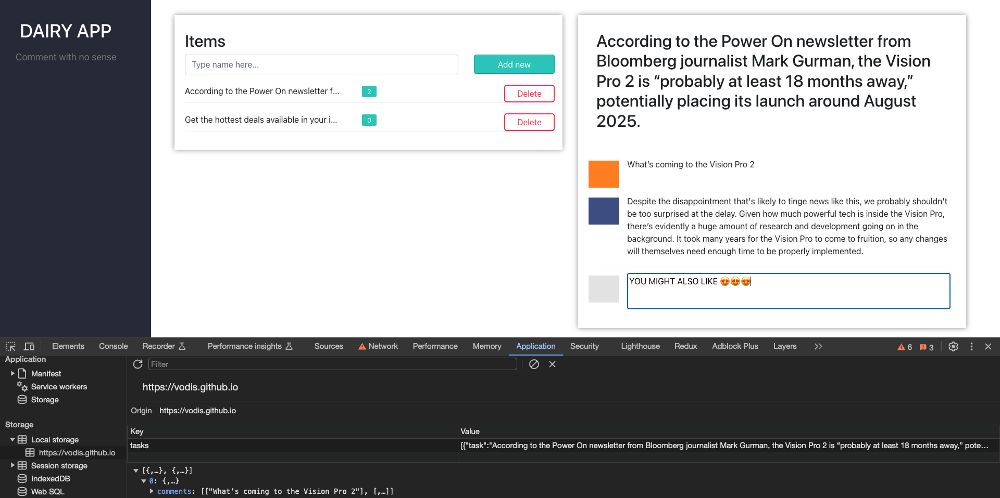

## Intro to DAIRY APP with GitHub Pages
Welcome to DAIRY APP built on React and serve on GitHub Pages! We’re excited to show our result.

### GitHub Pages
Ready to get started? Build your own site from scratch or generate one for your project. If so, follow up how it builds by links below.

### Documentation
1. [GitHub# documentation](https://pages.github.com/)
2. [React documentation](https://react.dev/)

### Branchspace
1. `master` - static react build
2. `hotfix` - react app

## What is DAIRY APP? 
DAIRY APP is SPA application, uses local storage for storing your thoughts and comments in your secret place.

